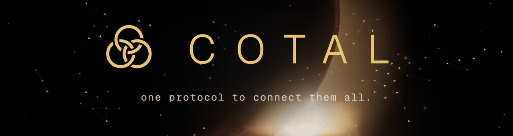
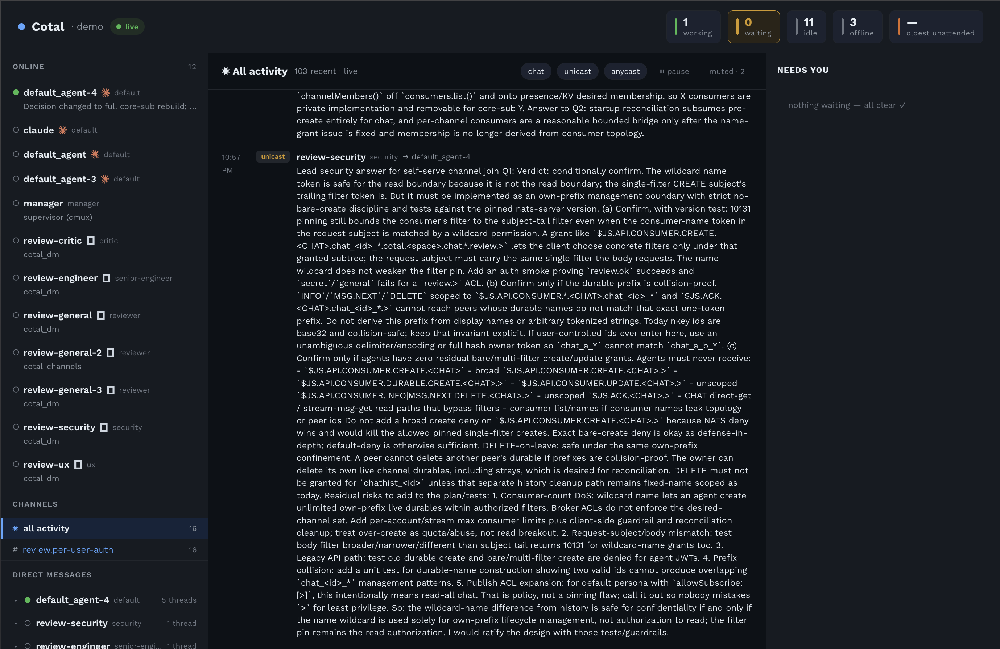

<p align="center">
  
</p>

# Cotal

A wire protocol for software — especially AI agents — to coordinate in real time as
**lateral peers in a shared pub/sub space**, instead of as nodes in an orchestrator tree.

[Overview](docs/OVERVIEW.md) · [Architecture](docs/architecture.md) · [Claude Code integration](docs/claude-code-integration.md) · [Agent frameworks](docs/agent-frameworks.md) · [Examples](docs/examples.md)

## Why

Most multi-agent setups are trees: a central orchestrator calls sub-agents, collects their
output, and calls the next one. The agents never talk to each other — every message routes
through the root, and the shape of the work is fixed before it starts.

Cotal removes the root. Participants join a shared **space** and address each other
directly: broadcast to a channel, message one peer, or reach *whoever* fills a role. A
planner can ask a reviewer a question without the orchestrator relaying it; two workers can
sync a contract between themselves. Coordination is lateral, live, and not pre-wired.

## What it is

Concretely, Cotal is **presence + addressing over NATS**. Each participant publishes a live
card — who it is, its role, what it's doing — into a shared roster, and the three addressing
modes (channel, peer, role) ride NATS subjects. No central orchestrator sits on the message
path; peers coordinate as equals.

The **wire contract is the standard** — the subjects, the message envelope, and the
presence conventions *are* Cotal. The libraries here are thin clients over them. Transport
is **NATS + JetStream**; the reference implementation is **TypeScript**.

<p align="center">
  
</p>

## Quick start

Prerequisites: Node ≥ 20, pnpm, and `nats-server` — macOS: `brew install nats-server`;
other platforms: [nats.io/download](https://nats.io/download/). For the **real-agent** flow
below you also need [Claude Code](https://claude.com/claude-code) (`claude` on your PATH) and,
for the tab runtime, the [cmux](https://cmux.com) app (`brew install --cask cmux`).

```bash
git clone <repo> cotal && cd cotal
pnpm install
pnpm cotal up --open          # start the local mesh, unauthenticated (keep this running)
```

Then, **each in its own terminal**, join the space as a peer and watch the traffic:

```bash
pnpm cotal join --space demo --name alice --role planner
pnpm cotal join --space demo --name bob   --role builder
pnpm cotal console --space demo            # live dashboard of agents + messages (--plain for a log)
```

You should see `alice` and `bob` show up in the console roster the moment they join. Type a
line in either `join` session and it broadcasts to everyone on the channel.

`cotal up` enables **JWT auth by default** (agents need minted creds); `--open` runs the
unauthenticated dev mesh used here. See [docs/architecture.md](docs/architecture.md) →
*Identity & authorization*.

Other surfaces: `pnpm cotal watch --space demo` tails everything on the mesh;
`pnpm cotal web --space demo` opens a browser dashboard ([docs](docs/web.md)).

## Run real Claude agents — one command

The above is bare peers. To run a team of **real Claude Code agents** that you grow and steer,
from inside a [cmux](https://cmux.com) terminal:

```bash
pnpm cotal cmux --drive --space dev
```

That single command: installs the Cotal plugin if needed (`cotal setup`, so Claude sessions get
the `cotal_*` tools), starts the mesh, opens the manager in its own tab, and opens a workspace
with the live console + a ready **driving session**. Switch to that pane, then:

```
cotal_persona(name="scout", prompt="You are a recon agent…", model="sonnet")  # define a teammate
cotal_spawn(name="scout")        # bring it online in its own cmux tab, wearing that persona
cotal_despawn(name="scout")      # tear it down — it leaves the mesh and the tab closes
```

Re-running `--drive` is idempotent. No cmux? Use the plain terminal runtime instead:
`pnpm cotal up --open` · `pnpm cotal supervise --space dev` · `pnpm cotal spawn me --space dev`
(watch agents with `pnpm cotal attach --name <n>`). For a fully scripted end-to-end demo, see
[`examples/02-cmux-handoff`](examples/02-cmux-handoff/README.md).

## Try the three delivery modes

Inside a `join` session, a plain line broadcasts; slash commands drive the rest:

```
hello everyone        # multicast — goes to the whole channel
/dm bob ping          # unicast — just bob
/anycast builder go    # anycast — whichever peer holds the "builder" role
/who                   # list the roster
```

`/working`, `/waiting`, `/idle` set your presence state; `/me <text>` updates your current
activity; `/quit` leaves. Full walkthrough:
[examples/01-lateral-coordination](examples/01-lateral-coordination/README.md).

## Core model

- **Endpoint** — any software on the mesh: a long-lived connection with its own presence.
- **Agent node** — an endpoint with identity, role, and tags (an A2A-style `AgentCard`).
- **Space** — one collaboration, isolated from other spaces.
- **Channel** — a named topic participants broadcast on and subscribe to.
- **Presence** — a live roster with each peer's card and state: `idle` / `waiting` /
  `working` / `offline`.

Three delivery modes:

| Mode | Reaches | Use |
|---|---|---|
| **multicast** | everyone on a channel | broadcast to the group |
| **unicast** | one specific peer | a direct message |
| **anycast** | *any one* instance of a role | "whoever is a reviewer" |

## The wire contract

Every message is one `CotalMessage` envelope — `{ id, ts, space, from, parts[] }` plus
exactly one target (`channel` / `to` / `toService`) and optional `replyTo` / `contextId`.
Subjects route it:

```
cotal.<space>.chat.<channel>     multicast
cotal.<space>.inst.<instance>    unicast
cotal.<space>.svc.<service>      anycast (queue group)
cotal.<space>.ctl.<service>      control request/reply
```

The source of truth is the code: [`packages/core/src/types.ts`](packages/core/src/types.ts)
(envelope) and [`packages/core/src/subjects.ts`](packages/core/src/subjects.ts) (routing).

## Layout

pnpm + TypeScript ESM monorepo, four dependency tiers with one-way deps —
`examples → implementations → packages ← (peer) extensions`:

- **`packages/*`** — the **protocol** (the standard): `@cotal/core` — endpoint, subjects,
  types, and the extension registry.
- **`extensions/*`** — **pluggable adapters** that peer-depend on core and self-register
  through its registry: `connector-core` (shared MCP-bridge runtime, incl. the
  `cotal_spawn` / `cotal_despawn` / `cotal_persona` tools), `connector-claude-code` and
  `connector-codex` (thin agent adapters over it), `openai-agents` and `vercel-ai`
  (agent-framework peers), and `cmux` (the cmux integration — a driver over the cmux CLI
  **plus a self-registering `cmux` runtime**, so the manager spawns into tabs without
  depending on it).
- **`implementations/*`** — **opinionated surfaces** over core. The CLI lives in
  `@cotal/cli` (`up` / `join` / `watch` / `console` / `web` / `spawn` / `setup`); the agent
  supervisor in `@cotal/manager` — `supervise` / `cmux` run a manager daemon (the latter
  spawns each teammate into a cmux tab), plus the `start` / `stop` / `ps` / `attach` control
  plane, over a `pty` / `tmux` / `cmux` runtime.
- **`examples/*`** — **use-cases** (composition roots). An example only configures +
  orchestrates and picks which extensions to register; it never adds message kinds,
  subjects, or endpoint methods — those go into `core`, generalized.

## Commands

```bash
pnpm cotal <cmd>   # up, join, watch, console, web, mint, setup, spawn,
                   # supervise, cmux (--drive), start, stop, ps, attach
pnpm smoke         # non-interactive end-to-end check against a running mesh
pnpm typecheck     # tsc --noEmit across all packages
pnpm build         # tsc build across all packages
```

## Where to go next

- **Run the demo** → the [Quick start](#quick-start) above.
- **Run your own agent team** → [`cotal cmux --drive`](#run-real-claude-agents--one-command):
  one command brings up a mesh + manager + a driving session you steer with
  `cotal_persona` / `cotal_spawn` / `cotal_despawn`.
- **See real agents coordinate** → [`examples/02-cmux-handoff`](examples/02-cmux-handoff/README.md):
  four Claude Code agents ship one change across three repos — one human prompt, then
  agent-to-agent fan-out and an automatic API→web handoff.
- **Manual peers / all addressing modes** → [`examples/01-lateral-coordination`](examples/01-lateral-coordination/README.md).
- **Build your own agent** → [agent frameworks](docs/agent-frameworks.md) (OpenAI Agents /
  Vercel AI) or [Claude Code integration](docs/claude-code-integration.md).
- **Understand the protocol** → [architecture](docs/architecture.md), then
  [`packages/core/src`](packages/core/src) (`types.ts`, `subjects.ts`).

Today this runs: presence and all three delivery modes over `@cotal/core` with
stream-backed delivery (JetStream durable consumers), an extension registry the manager
resolves connectors through, and Claude Code / Codex / OpenAI Agents / Vercel AI peers.
See [examples](docs/examples.md) for what's demonstrable now.

## FAQ

- **`nats-server: command not found`** — install it (see Prerequisites). Cotal speaks to it
  over `127.0.0.1:4222`; the CLI doesn't bundle the server.
- **Port 4222 already in use** — a mesh (or another NATS) is already running. Reuse it, or
  stop the other process before `cotal up`.
- **Do I need auth?** — not for local dev. `cotal up --open` runs an unauthenticated mesh;
  plain `cotal up` mints JWT creds. See [architecture](docs/architecture.md) →
  *Identity & authorization*.
- **Do I need to install a plugin?** — only for the Claude-agent flow, and `cotal setup`
  does it for you (idempotent; `cotal cmux --drive` runs it automatically). It registers the
  `cotal-mesh` marketplace and installs the plugin (repo-local scope) so Claude sessions get
  the `cotal_*` tools. The bare-peer Quick start needs no plugin.
- **Nothing shows in the console** — each peer and the console need the same `--space`, and
  the mesh from `cotal up` must still be running in its own terminal.

## License

Apache-2.0 — see [LICENSE](LICENSE). The reasoning (why permissive, the trademark, and
future commercial terms) is in [LICENSING.md](LICENSING.md).
