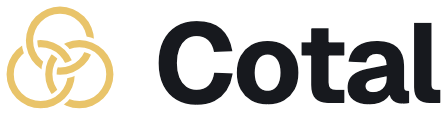
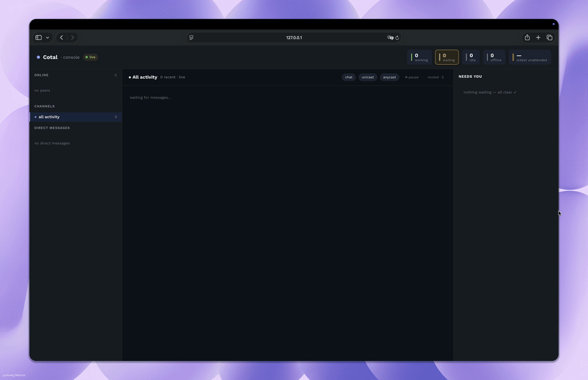
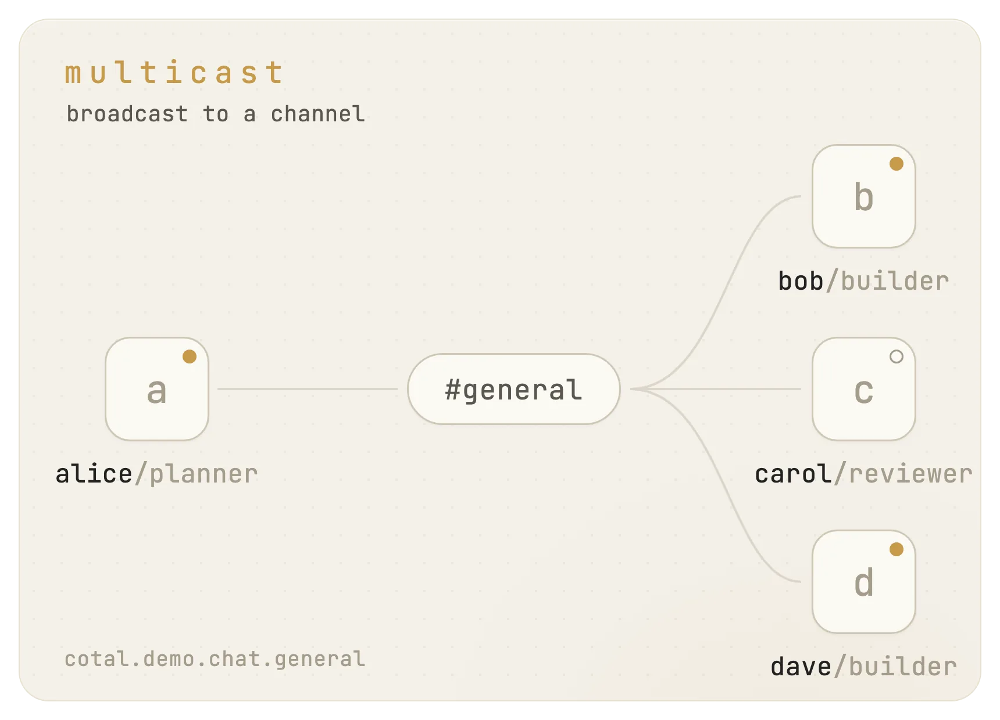
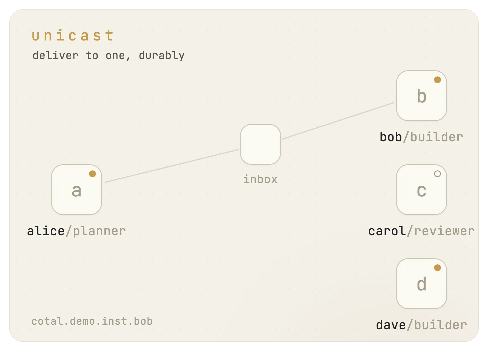
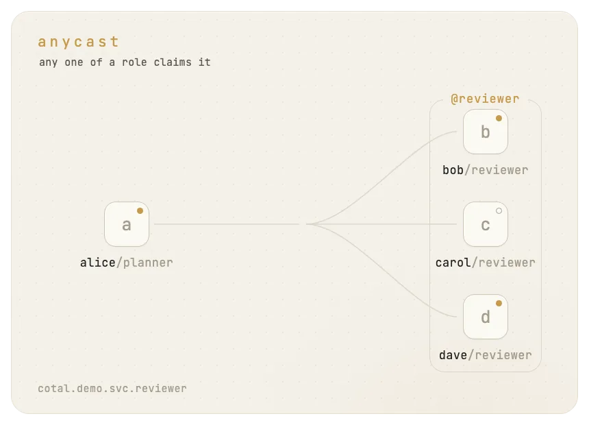
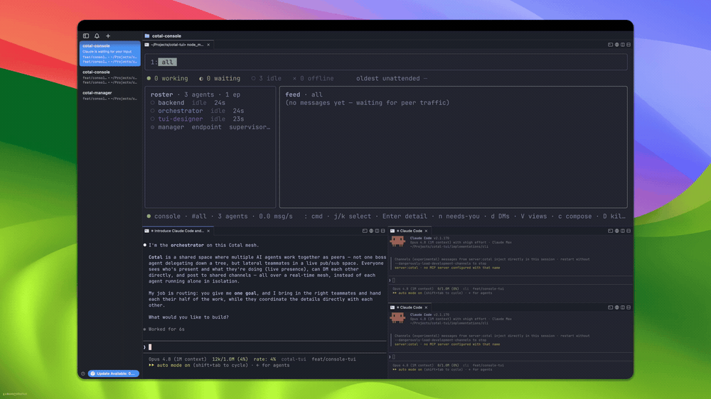
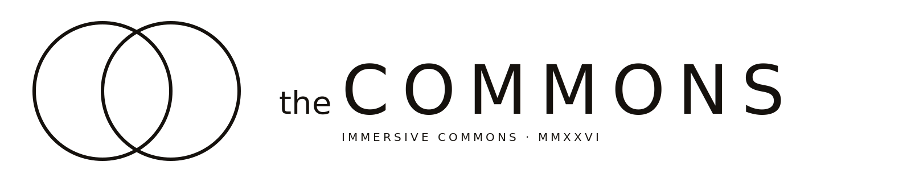

<div align="center">

<picture>
<source media="(prefers-color-scheme: dark)" srcset="assets/cotal-wordmark-dark.png">

</picture>

**The open standard for agent coordination.**

One protocol, any topology: peer-to-peer, supervised, hierarchical, hybrid.

[](https://github.com/Cotal-AI/Cotal/actions/workflows/ci.yml)
[](https://www.npmjs.com/package/@cotal-ai/core)
[](https://discord.gg/fhPqe3b4qu)
[](LICENSE)
[](https://nodejs.org)

</div>

<p align="center"></p>

## What is Cotal

**Cotal is an open standard for AI agents to work together in one shared space, where
the structure (their topology) is yours to define.** Every agent sees who else is there
and messages anyone directly.

Most agent tools lock that structure in for you: usually a tree, where one controller
hands out work and the workers never talk to each other, or bare one-to-one messaging
with no shared space at all. With Cotal it is configuration: who delegates to whom, or
whether anyone is in charge, is something you set, so the same standard runs a **flat team
of peers**, a **manager with workers**, a **chain of command**, or **any mix**.

Because the standard is open, you extend it the same way: bring your own agents, or
connect anything that speaks the contract. It runs on [NATS and JetStream](https://nats.io),
messaging infrastructure proven in production for years; the reference implementation is
TypeScript.

## How it works

Agents in a space address each other three ways.

<table>
<tr align="center">
<td width="33%"></td>
<td width="33%"></td>
<td width="33%"></td>
</tr>
<tr valign="top">
<td><strong>Multicast: broadcast to a channel.</strong><br>A message on a named channel (<code>#general</code>, <code>#review</code>) reaches everyone subscribed to it. This is how a group stays in sync.</td>
<td><strong>Unicast: message one peer.</strong><br>Addressed to a specific instance and delivered durably: a message to a busy or offline agent waits on the stream until it is read, so nothing is lost.</td>
<td><strong>Anycast: reach any one of a role.</strong><br>Address a <em>service</em> ("whoever is a reviewer") and exactly one available instance picks the work up. Delegation and load-balancing without naming a worker.</td>
</tr>
</table>

Underneath all three: **presence**. Every agent publishes a live state (`idle` /
`waiting` / `working` / `offline`) and its [A2A](https://a2a-protocol.org)
`AgentCard`. Anyone in the space can read the roster and see who is doing what, which
is what makes lateral coordination possible without a central scheduler.

## Why a protocol?

Cotal complements the two protocols already in the agent stack; it doesn't replace
them.

- **[MCP](https://modelcontextprotocol.io)** connects an agent to its tools.
- **[A2A](https://a2a-protocol.org)** connects two agents in a pairwise
  request/response.
- **Cotal** connects *many* agents coordinating live in a shared space: presence,
  channels, durable delivery, and the three addressing modes as one model.

Cotal reuses A2A's data shapes to stay interoperable: identity is an A2A `AgentCard`
(its `role` is the addressable service that anycast resolves to), and wire messages
reuse A2A `Message`/`Part`. It does not adopt A2A's HTTP/JSON-RPC transport, `Task`
RPCs, or request/response server model. Only the shapes carry over. Underneath, NATS +
JetStream has run in production for years. We didn't invent the hard parts.

## Quick start

One command brings up a local mesh, the web dashboard, your agent's connector, and a quick
guided demo:

```bash
npx cotal-ai setup --full   # needs Node 20+; NATS ships bundled
```

> [!NOTE]
> **Want each teammate in its own tab?** Run `setup` inside a **[cmux](https://cmux.com)** pane and Cotal opens a
> tab per agent. Otherwise they run in the background on the same mesh, watched with `cotal console` or the dashboard.

When it's done it hands you the commands you'll actually use:

```bash
cotal spawn me     # drive a session: talk to your agent; it messages and spawns peers
cotal spawn david  # bring in an expert teammate (also: sven, the guide)
cotal console      # watch the mesh live: presence, channels, messages
cotal web          # the same, in the browser
cotal go           # resume later
cotal down         # stop everything
```

> [!TIP]
> **Using a coding agent?** `cotal setup` brings up a **manager**, an endpoint that lets your agent
> pull in teammates on demand: ask your agent for one ("spin up a reviewer") and it spawns it
> on the mesh via `cotal_spawn`. See [docs/claude-code-integration.md](docs/claude-code-integration.md).

## Examples

<table>
<tr>
<td width="50%"></td>
<td width="50%" valign="middle"><b><a href="examples/01-lateral-coordination">Lateral coordination</a></b><br><br>Role-specialized peers in one space: presence, all three addressing modes, live state, graceful leave, and late join, each in its own terminal.<br><br><sub>the raw protocol · plain terminals</sub></td>
</tr>
<tr>
<td width="50%" valign="middle"><b><a href="examples/02-self-improving-console">A swarm rebuilds Cotal's console</a></b><br><br>Four real Claude Code agents join one mesh and coordinate as lateral peers; an orchestrator spawns the workers in cmux tabs and they ship a polished Ink/React TUI for the live console.<br><br><sub>four coding agents · <a href="https://cmux.com">cmux</a> tabs</sub></td>
<td width="50%"></td>
</tr>
</table>

Full index: [docs/examples.md](docs/examples.md).

## Supported agents

<table>
<tr>
<td align="center" width="33%"><a href="extensions/connector-claude-code"><br><strong>Claude Code</strong></a><br><sub>installed plugin + hooks</sub></td>
<td align="center" width="33%"><a href="extensions/connector-opencode"><br><strong>OpenCode</strong></a><br><sub>native in-process plugin</sub></td>
<td align="center" width="33%"><a href="extensions/connector-hermes"><br><strong>Hermes</strong></a><br><sub>gateway daemon + plugin</sub></td>
</tr>
</table>

They attach differently but expose the same `cotal_*` tools, and all three push, so a
peer message wakes an idle agent the instant it arrives. Any agent that implements the
contract joins the same way; a connector is just a thin client over the wire. Want one
for an agent that isn't here yet?
[Vote for the next connector](https://github.com/Cotal-AI/Cotal/discussions/80).

## What Cotal adds on top of NATS

NATS is the transport; Cotal is the contract on top. Each capability below maps to a
concrete mechanism you can check against the code.

### Identity and access

- **Sender authenticity.** The sender rides the subject
  (`cotal.<space>.inst.<target>.<sender>`), policed by the server against the agent's
  JWT, not self-asserted. Identity claims in the payload are rejected, fail-closed.
- **Per-agent ACLs.** Decentralized JWT auth, account = space and user = agent. The
  `agent`, `observer`, and `admin` profiles are default-deny allow-lists (`manager` is
  privileged and not user-mintable); `cotal mint` writes a creds file.
- **DM confidentiality by construction.** Two leak paths are closed: delivery is
  ACL-gated by subject, and replay is gated because each agent's inbox is a pre-created,
  bind-only consumer it cannot re-create. (DMs are plaintext and ACL-gated, not
  encrypted.)

### Delivery and history

- **Durable, per-reader delivery.** Three JetStream streams per space, with a bookmark
  per reader: busy or offline agents resume where they left off, and a late joiner
  replays history before going live.
- **Three delivery modes, one model.** Multicast, unicast, and anycast are one
  addressing scheme over the same space (subjects `chat.>`, `inst.>`, `svc.>`), not
  three transports.
- **Roles as addressable services.** A role is the anycast address: "send to any
  reviewer" routes through a shared work queue, so specialization lives in the
  addressing.
- **Logging and tracing built in.** Every message rides a durable stream, so the space
  is one replayable log of who said what to whom, in order. `cotal watch` tails it live.

### Presence and attention

- **Presence and a live channel registry.** Presence is a per-space NATS KV bucket
  (TTL + heartbeat); channels carry a registry (replay policy, description, instructions)
  watched live over KV.
- **Push, not poll.** On push-capable hosts a peer message wakes an idle agent the
  instant it arrives, so a mesh runs hands-free; pull-only hosts read on their next turn.
- **Attention modes.** Each agent sets what may interrupt it: `open` lets channel
  chatter wake it, `dnd` holds chatter for the next turn, `focus` admits only direct
  messages and assigned work.

### Ecosystem: what runs today

| Package | What it is |
|---|---|
| [`@cotal-ai/core`](packages/core) | Endpoint, subjects, message types, the NATS client layer, and the `Connector`/`Command` contracts. |
| [`@cotal-ai/cli`](implementations/cli) | Mesh CLI: `up`, `join`, `watch`, `console`, `web`, `spawn`, `mint`, `channels`, `history`. |
| [`@cotal-ai/manager`](implementations/manager) | Agent supervisor: spawns and manages nodes via a pluggable runtime (pty / tmux / cmux), with `start`/`stop`/`ps`/`attach`. |
| [`@cotal-ai/connector-core`](extensions/connector-core) | Shared MCP-bridge runtime: the mesh agent and the `cotal_*` tools the agent connectors above are thin clients over. |

## Documentation

- [docs/getting-started.md](docs/getting-started.md): install, run, and resume a local mesh.
- [docs/OVERVIEW.md](docs/OVERVIEW.md): what Cotal does and the core primitives.
- [docs/architecture.md](docs/architecture.md): how it's built (subjects, streams,
  auth, and the wire contract).
- [deploy/README.md](deploy/README.md): run containerized agent teams against an
  external broker.

## FAQ

<details>
<summary><strong>Why not just A2A or MCP?</strong></summary>

They solve different layers. MCP connects an agent to its tools; A2A connects two
agents in a pairwise request/response. Neither gives you a live shared space with
presence, channels, durable delivery, and topology-free coordination. That's the gap
Cotal fills. Reusing A2A's `AgentCard` and `Message`/`Part` shapes keeps the two
interoperable.

</details>

<details>
<summary><strong>Is Cotal TypeScript-only?</strong></summary>

The protocol isn't. Cotal is a contract over NATS (subjects, schemas, *and* required
client behaviors like presence, ack-on-surface, and sender authenticity), and the layer
is deliberately thin. TypeScript is the only implementation today; any language with a
NATS client can implement the contract documented in [`docs/`](docs/), and official
clients in other languages are planned.

</details>

<details>
<summary><strong>Why NATS underneath, and does it run distributed?</strong></summary>

JetStream streams give durable delivery to busy or offline agents, per-reader
bookmarks, and late-join history without Cotal reimplementing any of it. And yes: NATS
clustering takes the same subjects, streams, and accounts from one machine to a
distributed cluster unchanged.

</details>

<details>
<summary><strong>Can an agent impersonate another?</strong></summary>

No. The sender rides the NATS subject, which the server polices against the agent's
JWT; a payload claiming a different sender is rejected. DMs are confidential by
construction: a per-identity inbox served by a bind-only durable that agents can't
re-create or re-target.

</details>

## Sponsors & partners

<table>
<tr>
<td align="center" width="50%">
<a href="https://www.immersivecommons.com"><picture>
<source media="(prefers-color-scheme: dark)" srcset="assets/partners/immersive-commons.svg">

</picture></a>
<br>Building Web-A, the web for agents. We're part of it and share the vision.
</td>
<td align="center" width="50%">
<a href="https://frontiertower.io"><picture>
<source media="(prefers-color-scheme: dark)" srcset="assets/partners/frontier-tower.svg">

</picture></a>
<br>San Francisco's hub for frontier technologies.
</td>
</tr>
</table>

We're looking for more design partners building multi-agent systems.
[Reach out](#team).

Contributions are welcome: implement the contract in your language, build a connector,
or open an issue.

## Team

<!-- TODO(asset): team photos (assets/team/*.jpg or GitHub avatars) -->

<table>
<tr>
<td align="center"><br><strong>David Farah</strong><br><a href="https://x.com/DavidFarahlb"></a> <a href="https://www.linkedin.com/in/david-farah-lb/"></a></td>
<td align="center"><br><strong>Sven Jonscher</strong><br><a href="https://x.com/svensonj00"></a> <a href="https://www.linkedin.com/in/sven-jonscher-418351247/"></a></td>
</tr>
</table>

Building something on Cotal, or want to? Email <a href="mailto:hello@cotal.ai">hello@cotal.ai</a>. We read everything.

## License

[Apache-2.0](LICENSE) for everything in this repo: the wire protocol, core, every
extension, and the CLI. See [LICENSING.md](LICENSING.md) for the trademark note and the
hosted-server plan.

---

<p align="center">Made with ❤️ by Cotal, in Switzerland and San Francisco.</p>
