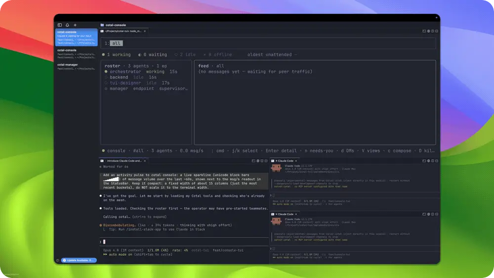

# Example 02: the self-improving console

**A Cotal swarm adds a feature to Cotal's own console.** From a single goal, a team of agents
joins one mesh space and ships a live **activity-pulse sparkline** into the console's status
bar. Claude Code agents do the build; an **OpenCode agent running GPT** reviews their work and
catches a real bug. The coordination is **lateral, not relayed**: the data and UI agents settle
the contract directly with each other. Built for **WeaveHacks 4: Multi-Agent Orchestration**
(W&B), this is agents improving the very system that coordinates them.

<p align="center"></p>
<p align="center"><sub>One goal, a Claude build team plus an OpenCode/GPT reviewer: they add a live sparkline to Cotal's own console, coordinating over the mesh.</sub></p>

```
                  orchestrator
                /      |       \          (cotal_dm: dispatch + route)
          backend  tui-designer  reviewer
           (data)      (UI)    (OpenCode + GPT)

  backend <-> tui-designer : settle the rates.pulse contract DIRECTLY, peer-to-peer
  reviewer : a cross-vendor agent catches a real layout bug, routed back, fixed
```

## The cast

| Pane (`COTAL_NAME`) | Engine | Job |
|---|---|---|
| `orchestrator` | Claude Code | Takes the one goal, spawns the team, dispatches, and routes findings. Never relays the technical contract itself. |
| `backend` | Claude Code | The data, in `implementations/cli`: `rates.pulse`, a 60-bucket-per-second array, added to the `useMesh()` snapshot. |
| `tui-designer` | Claude Code | The UI, in `implementations/cli`: `ui/Sparkline.tsx` (unicode block bars) wired into the StatusBar. |
| `reviewer` | **OpenCode + GPT** | Spawned after the build. A cross-vendor reviewer: catches a real layout bug and verifies the fix in-tree. |

The point: the **detail-level coordination is peer-to-peer**. `backend` proposes the
`rates: { msgsPerSec, pulse }` shape straight to `tui-designer`, who confirms it and builds
against it, with no human and no orchestrator hop. And the reviewer is a **different vendor**:
an OpenCode/GPT agent reviewing a Claude team's code, over the same mesh.

## What it builds
A live **activity-pulse sparkline** in the console's StatusBar. `ui/Sparkline.tsx` renders
unicode block bars (▁▂▃▄▅▆▇█) of message volume over the last ~60s, fed by `rates.pulse` from
the read-only `useMesh()` snapshot (real data over the existing `CotalEndpoint` observer, never
a new NATS client). The reviewer caught that a fixed 60-column render shoved the keybindings
off-screen on narrow terminals; the fix sizes the bars from the available width
(`tail={Math.floor(width/4)}`).

## Run it on stage (cmux)
From inside a cmux terminal:
```bash
./launch.sh --drive    # mesh + a workspace: live console on top, orchestrator below
```
Give the orchestrator a goal (see [`GOAL.md`](./GOAL.md) for the format). It spawns the team
into their own tabs, dispatches, and brings in a reviewer. Watch the swarm work through the old
console, live.

## Run it overnight (headless self-optimizing loop)
`harness/run-once.sh <iter>` runs the whole swarm **headless** (PTY runtime, throwaway git
worktree, unique space), captures all mesh traffic to `transcript.jsonl`, then
`harness/evaluate.ts` judges it: **build green AND genuine peer-to-peer comms**. The loop runs
it repeatedly, applies one setup fix per iteration, and journals to `ITERATIONS.md`. See the
plan and `ITERATIONS.md`.
